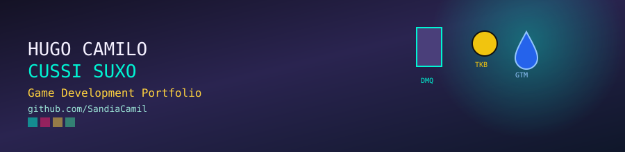
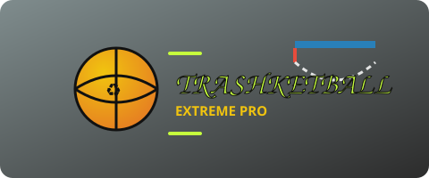
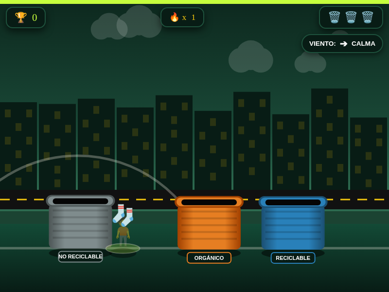

# 🎮 Game Development Portfolio

### Hugo Camilo Cussi Suxo

**Universidad Privada del Valle** · Ingeniería de Software · 4to Semestre
Game Development · Gestión 2 – 2026 · Paralelo A

---

## Sobre mí

¡Hola! Soy **Hugo Camilo**, pero en internet me conocen como **SandiaCamil** 🍉. Estudio Ingeniería de Software y actualmente curso la asignatura de **Game Development**, donde estoy dando mis primeros pasos serios en el diseño y programación de videojuegos.

Me atraen especialmente los **shooters tácticos**, los juegos de **aventura** y, en general, cualquier proyecto que combine mecánicas desafiantes con una buena narrativa o propósito detrás. Fuera de esta asignatura también me muevo entre el desarrollo Android (Kotlin), desarrollo web (Laravel/PHP, JavaScript) y algo de ciberseguridad — así que intento traer un poco de esa mentalidad de "romper y entender cómo funciona" también a mis juegos.

Este repositorio es mi **portafolio personal de Game Development**: reúne los prototipos que fui creando en las primeras clases de la materia, mostrando no solo el resultado final, sino también cómo fueron evolucionando desde su primera versión (beta) hasta la build más pulida.

---

## Presentación visual

<table>
<tr>
<td align="center" width="33%"></td>
<td align="center" width="33%"></td>
<td align="center" width="33%"></td>
</tr>
</table>

---

## Galería de videojuegos

<table>
<tr>
<th align="center" width="20%">Juego</th>
<th align="center" width="18%">Vista previa</th>
<th align="center">Descripción</th>
<th align="center" width="14%">Género</th>
<th align="center" width="16%">Tecnología</th>
<th align="center" width="12%">Enlaces</th>
</tr>

<tr>
<td align="center">
 
<b>DungeonMathQuest</b> 
La Torre de los Números
</td>
<td align="center">

</td>
<td>
Escala una torre maldita saltando entre plataformas y resolviendo operaciones matemáticas combinadas para avanzar de nivel. 10 niveles, cofres falsos y un sistema de rangos según tu desempeño.
</td>
<td align="center">Platformer educativo</td>
<td align="center">HTML5 Canvas JavaScript</td>
<td align="center">

[📁 Proyecto](games/dungeonmathquest/)
[▶ Jugar](games/dungeonmathquest/index.html)

</td>
</tr>

<tr>
<td align="center">
 
<b>Trashketball</b> 
Extreme Pro
</td>
<td align="center">

</td>
<td>
Encesta cada residuo en su contenedor correcto (orgánico, reciclable, no reciclable) arrastrándolo como una resortera, mientras el viento cambia tu trayectoria y los combos multiplican tu puntaje.
</td>
<td align="center">Arcade / Puntería</td>
<td align="center">HTML5 Canvas JavaScript</td>
<td align="center">

[📁 Proyecto](games/trashketball/)
[▶ Jugar](games/trashketball/index.html)

</td>
</tr>

<tr>
<td align="center">
 
<b>Gotitas Mágicas</b> 
Salva a Ajolí
</td>
<td align="center">

</td>
<td>
Mueve una canasta para atrapar gotas de agua pura (y power-ups de hielo, escudo y vidas extra) para purificar el agua y salvar a Ajolí, un ajolote que depende de que cuides el recurso hídrico.
</td>
<td align="center">Arcade / Catcher</td>
<td align="center">HTML5 JavaScript</td>
<td align="center">

[📁 Proyecto](games/gotitas-magicas/)
[▶ Jugar](games/gotitas-magicas/index.html)

</td>
</tr>

</table>

---

## Betas y evolución de cada proyecto

Uno de los objetivos de este portafolio es mostrar el **proceso**, no solo el resultado. Cada juego pasó por versiones intermedias (betas) antes de llegar a su forma final, y esas iteraciones quedan documentadas dentro de cada carpeta:

| Juego | Versiones documentadas | Cambio principal entre versiones |
|---|---|---|
| **DungeonMathQuest** | `v1 (Quiz)` → `v3 (Final)` | De un quiz de opción múltiple a un platformer completo con física de salto y plataformas |
| **Trashketball** | `v1 (Quiz)` → `v2 (Resortera)` → `v3 (Extreme Pro)` | De tocar el bote correcto → mecánica de arrastre tipo resortera → viento dinámico + combos + fondo urbano animado |
| **Gotitas Mágicas** | `v1 (Final)` | Prototipo único hasta el momento, documentado como base para futuras iteraciones |

Los detalles de cada beta, con capturas y explicación de qué cambió, están en el README individual de cada juego.

---

## 🛠️ Stack y herramientas utilizadas

Todos los prototipos fueron desarrollados con **HTML5, CSS3 y JavaScript vanilla**, usando el elemento `<canvas>` para el renderizado en tiempo real, sin frameworks ni librerías externas de juego. Esto fue una decisión intencional para entender bien los fundamentos: loops de juego, detección de colisiones, manejo de input (teclado, mouse y touch) y gestión de estado, antes de dar el salto a un motor como Godot o Unity más adelante en la materia.

En partes del proceso de estos prototipos usé asistencia de IA (Claude) principalmente para acelerar boilerplate de UI, generar variaciones visuales y depurar bugs puntuales de física/colisiones — el diseño de las mecánicas, balance y dirección de cada juego fue decisión propia.

---

## Qué aprendí

- A estructurar un game loop desde cero con `requestAnimationFrame`, sin depender de un motor.
- Diferencias reales entre diseñar para **teclado** (DungeonMathQuest) vs. **mouse/touch** (Trashketball, Gotitas Mágicas), y cómo eso cambia por completo el *game feel*.
- La importancia de iterar: ninguno de los 3 juegos quedó bien a la primera versión — Trashketball especialmente pasó por 3 rediseños de mecánica central.
- A comunicar un proyecto: escribir un buen README es tan parte del trabajo como programar el juego.

## Qué mejoraría en una siguiente versión

- Migrar los prototipos a un motor real (Godot) para manejar mejor física, partículas y sonido.
- Agregar sonido y música — ninguno de los 3 prototipos actuales tiene audio.
- Guardar progreso/puntajes en un backend en vez de solo `localStorage`.
- Sumar más niveles y una curva de dificultad más progresiva en Trashketball y Gotitas Mágicas.

---

**📬 Contacto:** [github.com/SandiaCamil](https://github.com/SandiaCamil)

Portafolio construido para la asignatura de Game Development — Universidad Privada del Valle, Gestión 2-2026, Paralelo A.

