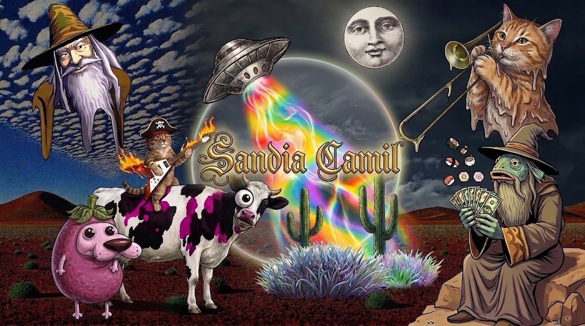
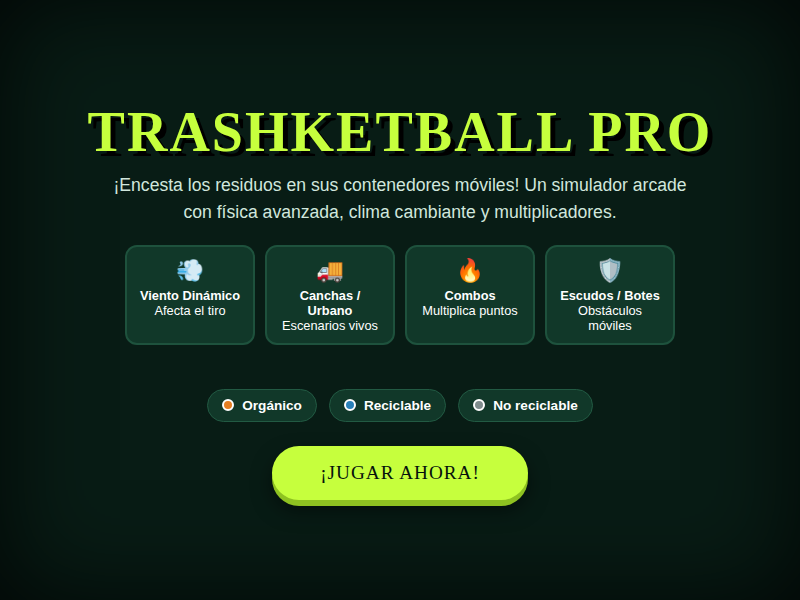
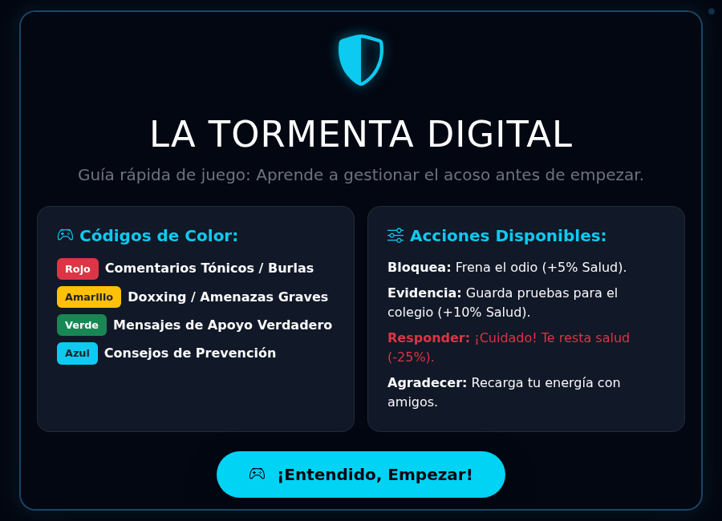
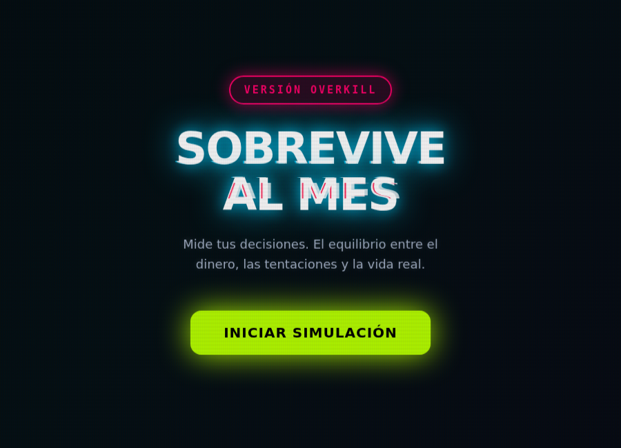

# Game Development Portfolio

### Hugo Camilo Cussi Suxo — SandiaCamil

**Universidad Privada del Valle** · Ingeniería de Software · 4to Semestre
Game Development · Gestión 2 – 2026 · Paralelo A

---

## Sobre mí

Soy **Hugo Camilo**, conocido en internet como **SandiaCamil**. Estudio Ingeniería de Software y curso la asignatura de Game Development, donde estoy dando mis primeros pasos en diseño y programación de videojuegos generados con apoyo de IA a partir de casos reales.

Me interesan especialmente los **shooters tácticos** y los juegos de **aventura**; fuera de esta materia también trabajo en desarrollo Android, desarrollo web y ciberseguridad.

Este repositorio reúne los prototipos jugables que fui construyendo, cada uno pensado para transmitir un mensaje concreto — desde educación financiera hasta prevención del ciberacoso. Se puede jugar cada versión directamente desde el navegador.

---

## Los juegos

### DungeonMathQuest — La Torre de los Números

<table>
<tr>
<td width="45%">

Un platformer para repasar operaciones aritméticas combinadas sin que se sienta una guía de ejercicios: el jugador salta entre plataformas y debe tocar el cofre con el resultado correcto de cada operación, evitando los cofres señuelo. La idea es que resolver bien la cuenta sea la única forma de seguir avanzando.

</td>
<td width="55%" align="center">

Pantalla de bienvenida — versión final
</td>
</tr>
</table>

---

### Trashketball — Extreme Pro

<table>
<tr>
<td width="45%">

Un arcade de puntería para aprender a separar residuos correctamente: cada objeto hay que encestarlo en su contenedor (orgánico, reciclable, no reciclable) antes de que se acabe el tiempo, mientras el viento desvía la trayectoria y los aciertos seguidos activan un combo. La repetición bajo presión de tiempo es lo que hace que la clasificación se quede grabada.

</td>
<td width="55%" align="center">

Pantalla de bienvenida — Extreme Pro
</td>
</tr>
</table>

---

### Gotitas Mágicas — Salva a Ajolí

<table>
<tr>
<td width="45%">

Un arcade tipo catcher sobre el ahorro de agua: se mueve una canasta para atrapar únicamente gotas de agua limpia y evitar el resto de objetos que caen, mientras Ajolí (un ajolotito) depende de que el río se mantenga limpio. El mensaje de fondo es simple: cada gota que se deja caer es agua que se pierde.

</td>
<td width="55%" align="center">

Pantalla de bienvenida
</td>
</tr>
</table>

---

### Verdu-chan — Guerra Contra la Comida Chatarra

<table>
<tr>
<td width="45%">

Un roguelike tipo *survivor*: Verdu-chan, una zanahoria protagonista, resiste oleadas crecientes de comida chatarra con ataque automático, mientras recoge verduras que la curan y le dan experiencia para elegir mejoras. Convierte la idea de "comer sano te hace más fuerte" en la mecánica central del juego, en vez de solo decirla.

</td>
<td width="55%" align="center">

Pantalla de bienvenida — versión final
</td>
</tr>
</table>

---

### La Tormenta Digital

<table>
<tr>
<td width="45%">

Una narrativa interactiva sobre ciberacoso escolar: el jugador no dispara ni esquiva, decide cómo reaccionar ante cada comentario que le llega al protagonista — bloquear, guardar evidencia, responder o agradecer — y cada decisión afecta su salud emocional. El mensaje central: engancharse a discutir con el odio anónimo hace más daño que el odio mismo.

</td>
<td width="55%" align="center">

Pantalla de bienvenida — versión final
</td>
</tr>
</table>

---

### Sobrevive al Mes

<table>
<tr>
<td width="45%">

Un simulador de decisiones financieras: 30 días, un capital fijo y una meta de ahorro, con un evento de gasto distinto cada día que obliga a elegir entre disfrutar el presente o proteger la meta. No hay una respuesta obvia — el aprendizaje viene de sentir la consecuencia inmediata de cada decisión en el saldo, no de memorizar un consejo.

</td>
<td width="55%" align="center">

Pantalla de bienvenida — versión final
</td>
</tr>
</table>

---

## Jugar cualquier versión (betas incluidas)

Cada juego pasó por versiones intermedias antes de llegar a su forma final. Todas son jugables individualmente, no solo la última:

<table>
<tr><th align="left">Juego</th><th align="left">Versión</th><th align="left">Qué cambió</th><th align="center">Jugar</th></tr>

<tr>
<td rowspan="3"><b>DungeonMathQuest</b></td>
<td>v1 — Quiz</td>
<td>Quiz de opción múltiple, sin plataformas ni personaje</td>
<td align="center"><a href="https://sandiacamil.github.io/game-development-portfolio/games/dungeonmathquest/versions/v1-quiz.html">Jugar</a></td>
</tr>
<tr>
<td>v2 — Nivel plano</td>
<td>Primer prototipo con personaje y salto; cofres al ras del suelo</td>
<td align="center"><a href="https://sandiacamil.github.io/game-development-portfolio/games/dungeonmathquest/versions/v2-flatlevel.html">Jugar</a></td>
</tr>
<tr>
<td>v3 — Final</td>
<td>Plataformas a distinta altura, cofres falsos, controles táctiles</td>
<td align="center"><a href="https://sandiacamil.github.io/game-development-portfolio/games/dungeonmathquest/">Jugar</a></td>
</tr>

<tr>
<td rowspan="3"><b>Trashketball</b></td>
<td>v1 — Quiz</td>
<td>Tocar el bote correcto según el tipo de residuo, sin lanzamiento</td>
<td align="center"><a href="https://sandiacamil.github.io/game-development-portfolio/games/trashketball/versions/v1-quiz.html">Jugar</a></td>
</tr>
<tr>
<td>v2 — Resortera</td>
<td>Lanzamiento por arrastre, vidas y cronómetro de 60s</td>
<td align="center"><a href="https://sandiacamil.github.io/game-development-portfolio/games/trashketball/versions/v2-slingshot.html">Jugar</a></td>
</tr>
<tr>
<td>v3 — Extreme Pro</td>
<td>Viento dinámico, combos y ciudad animada de fondo</td>
<td align="center"><a href="https://sandiacamil.github.io/game-development-portfolio/games/trashketball/">Jugar</a></td>
</tr>

<tr>
<td rowspan="3"><b>Gotitas Mágicas</b></td>
<td>v1 — Original</td>
<td>Barra "río de Ajolí" abajo, sin panel de reglas ni cronómetro</td>
<td align="center"><a href="https://sandiacamil.github.io/game-development-portfolio/games/gotitas-magicas/versions/v1-original.html">Jugar</a></td>
</tr>
<tr>
<td>v2</td>
<td>Panel de reglas, cronómetro visible, barra "agua ahorrada" arriba</td>
<td align="center"><a href="https://sandiacamil.github.io/game-development-portfolio/games/gotitas-magicas/versions/v2-reglas.html">Jugar</a></td>
</tr>
<tr>
<td>v3 — Final</td>
<td>Power-ups, niveles progresivos, puntaje persistente</td>
<td align="center"><a href="https://sandiacamil.github.io/game-development-portfolio/games/gotitas-magicas/">Jugar</a></td>
</tr>

<tr>
<td rowspan="3"><b>Verdu-chan</b></td>
<td>v1 — Original</td>
<td>Fruta genérica como recolectable, solo otorga experiencia</td>
<td align="center"><a href="https://sandiacamil.github.io/game-development-portfolio/games/verdu-chan/versions/v1-original.html">Jugar</a></td>
</tr>
<tr>
<td>v2 — Balance</td>
<td>Enemigos reescalados, paleta de mejoras invertida, más variedad de fruta</td>
<td align="center"><a href="https://sandiacamil.github.io/game-development-portfolio/games/verdu-chan/versions/v2-balance.html">Jugar</a></td>
</tr>
<tr>
<td>v3 — Final</td>
<td>Verduras temáticas que curan vida, personaje con aura y animación pulida</td>
<td align="center"><a href="https://sandiacamil.github.io/game-development-portfolio/games/verdu-chan/">Jugar</a></td>
</tr>

<tr>
<td rowspan="3"><b>La Tormenta Digital</b></td>
<td>v1 — Tres carriles</td>
<td>Mini-juego de esquivar comentarios por carriles, sin narrativa</td>
<td align="center"><a href="https://sandiacamil.github.io/game-development-portfolio/games/la-tormenta-digital/versions/v1-tres-carriles.html">Jugar</a></td>
</tr>
<tr>
<td>v2 — Alex</td>
<td>Narrativa por días con sistema de decisiones sobre comentarios</td>
<td align="center"><a href="https://sandiacamil.github.io/game-development-portfolio/games/la-tormenta-digital/versions/v2-alex.html">Jugar</a></td>
</tr>
<tr>
<td>v3 — Final</td>
<td>4 categorías de comentario, protagonista renombrado a Rubén</td>
<td align="center"><a href="https://sandiacamil.github.io/game-development-portfolio/games/la-tormenta-digital/">Jugar</a></td>
</tr>

<tr>
<td rowspan="6"><b>Sobrevive al Mes</b></td>
<td>v1 — Original</td>
<td>Simulador de 30 días funcional, interfaz simple</td>
<td align="center"><a href="https://sandiacamil.github.io/game-development-portfolio/games/sobrevive-al-mes/versions/v1-original.html">Jugar</a></td>
</tr>
<tr>
<td>v2</td>
<td>Limpieza de código, misma mecánica</td>
<td align="center"><a href="https://sandiacamil.github.io/game-development-portfolio/games/sobrevive-al-mes/versions/v2.html">Jugar</a></td>
</tr>
<tr>
<td>v3 — Edición Neón</td>
<td>Primer rediseño visual con paleta neón</td>
<td align="center"><a href="https://sandiacamil.github.io/game-development-portfolio/games/sobrevive-al-mes/versions/v3-neon.html">Jugar</a></td>
</tr>
<tr>
<td>v4 — Ultra Neón</td>
<td>Estilo neón intensificado, eventos reajustados</td>
<td align="center"><a href="https://sandiacamil.github.io/game-development-portfolio/games/sobrevive-al-mes/versions/v4-ultra-neon.html">Jugar</a></td>
</tr>
<tr>
<td>v5 — Overkill Neon</td>
<td>Eventos de mayor impacto, ajustes previos a la final</td>
<td align="center"><a href="https://sandiacamil.github.io/game-development-portfolio/games/sobrevive-al-mes/versions/v5-overkill.html">Jugar</a></td>
</tr>
<tr>
<td>v6 — Final</td>
<td>Efecto glitch, panel de reglas explícito, balance final</td>
<td align="center"><a href="https://sandiacamil.github.io/game-development-portfolio/games/sobrevive-al-mes/">Jugar</a></td>
</tr>

</table>

Más detalle de cada beta (con capturas comparadas) en el README de cada juego: [DungeonMathQuest](games/dungeonmathquest/) · [Trashketball](games/trashketball/) · [Gotitas Mágicas](games/gotitas-magicas/) · [Verdu-chan](games/verdu-chan/) · [La Tormenta Digital](games/la-tormenta-digital/) · [Sobrevive al Mes](games/sobrevive-al-mes/)

---

## Stack y herramientas

La mayoría de los prototipos están hechos en **HTML5, CSS3 y JavaScript vanilla**, usando `<canvas>` para el renderizado cuando el juego lo requiere (DungeonMathQuest, Trashketball, Verdu-chan), y DOM/CSS puro para los de tipo narrativo o de tarjetas (Gotitas Mágicas, La Tormenta Digital, Sobrevive al Mes) — estos últimos apoyados en Bootstrap para la maquetación de paneles e interfaz. Sin frameworks de juego externos: decisión intencional para entender bien los fundamentos antes de pasar a un motor como Godot más adelante. Cada juego partió de un prompt de generación con IA, iterado manualmente después para corregir errores, ajustar balance y pulir la interfaz.

## Qué aprendí

- A traducir un mensaje o problema real en una mecánica de juego concreta, en vez de una lección explicada en texto.
- Diferencias reales entre diseñar para teclado (DungeonMathQuest, Verdu-chan) y para mouse/touch (Trashketball, Gotitas Mágicas, La Tormenta Digital, Sobrevive al Mes).
- Que ningún prototipo quedó bien a la primera versión: Sobrevive al Mes pasó por 6 iteraciones visuales y Trashketball cambió de mecánica central dos veces.
- Que documentar el proceso (registro de versiones, capturas comparadas) es tan parte del trabajo como programar.

## Qué mejoraría en una siguiente versión

- Migrar los prototipos a un motor real (Godot) para manejar mejor física, partículas y sonido.
- Agregar audio a los juegos que todavía no lo tienen.
- Guardar progreso o puntajes en un backend en vez de solo `localStorage`.
- Unificar la paleta visual entre juegos del mismo "universo" temático, manteniendo la identidad propia de cada uno.

---

**Contacto:** [github.com/SandiaCamil](https://github.com/SandiaCamil)

Portafolio de Game Development — Universidad Privada del Valle, Gestión 2-2026, Paralelo A.

