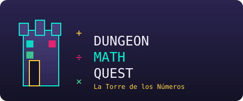
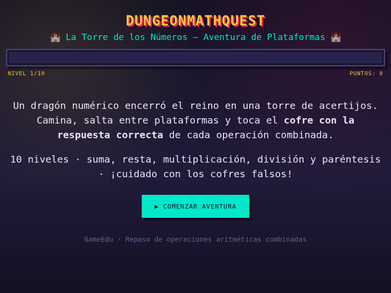
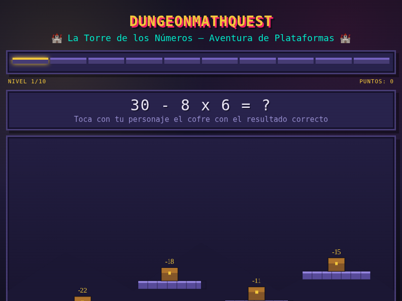
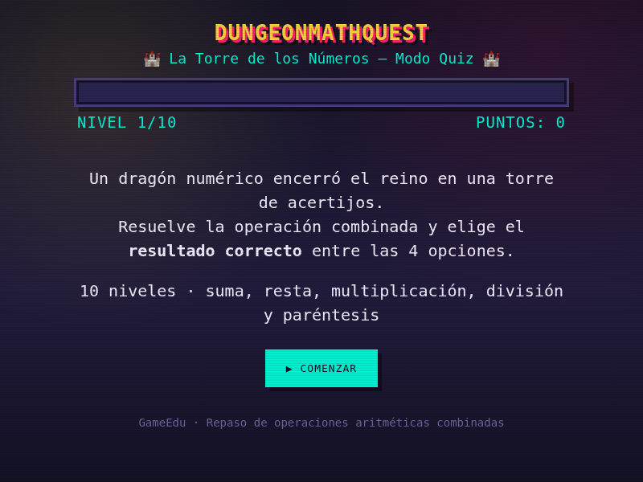
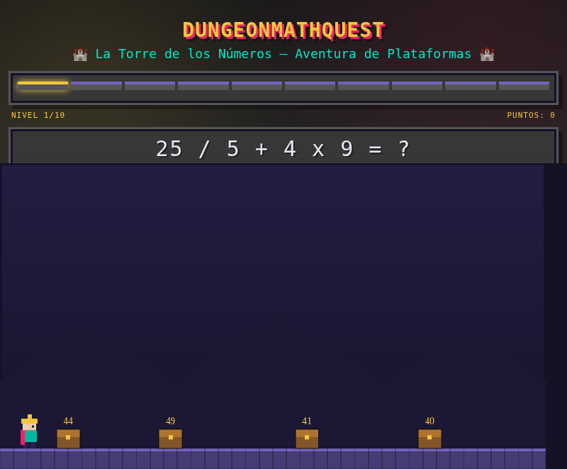

[◀ Volver al portafolio](../../README.md)

---

## 🏰 Sobre el juego

Un dragón numérico encerró el reino en una **torre de acertijos**. Como último aventurero capaz de descifrar sus enigmas, debes escalar la torre piso a piso, saltando entre plataformas suspendidas y resolviendo **operaciones matemáticas combinadas** para desbloquear el camino hacia la cima.

Cada nivel plantea una operación (suma, resta, multiplicación, división y uso de paréntesis) y varios cofres esparcidos entre las plataformas: solo uno tiene la respuesta correcta, los demás son **cofres falsos** que te harán perder el intento. La combinación de reflejos de plataformas + cálculo mental es la esencia del juego: no basta con saber la respuesta, hay que llegar hasta el cofre correcto antes de resbalar.

- **¿De qué trata?** De escalar una torre resolviendo matemáticas mientras controlas a un personaje en un entorno de plataformas.
- **¿Cuál es el objetivo del jugador?** Completar los 10 niveles eligiendo siempre el cofre con el resultado correcto, para obtener el mejor rango posible al final.
- **¿Cuál es la mecánica principal?** Movimiento lateral + salto entre plataformas, combinado con lectura y resolución de una operación aritmética por nivel.

## 🎮 Género

`Platformer` · `Puzzle educativo`

## ⌨️ Controles

| Acción | Tecla |
|---|---|
| Moverse a la izquierda | `←` / `A` |
| Moverse a la derecha | `→` / `D` |
| Saltar | `↑` / `W` / `ESPACIO` |
| Avanzar / continuar | Botón en pantalla `▶` |

*También cuenta con botones táctiles en pantalla (◀ ▶ SALTAR) para jugar desde dispositivos móviles.*

## 🏆 Sistema de puntaje

Al completar los 10 niveles se otorga un rango según los aciertos:

| Puntaje | Rango |
|---|---|
| 10/10 | 🏆 Gran Maestro del Reino |
| 8-9/10 | ⚔️ Caballero Calculador |
| 6-7/10 | 🛡️ Aprendiz Valiente |
| 4-5/10 | 🗡️ Escudero en Entrenamiento |
| menos de 4 | Sigue practicando |

## 🛠️ Tecnología utilizada

- **HTML5** (`<canvas>` para el renderizado del personaje y las plataformas)
- **CSS3** (estética retro pixel-art con las fuentes `Press Start 2P` y `VT323`)
- **JavaScript** vanilla — física de salto, detección de colisiones plataforma/cofre, generación de niveles y validación de operaciones

## 📸 Capturas de pantalla

<table>
<tr>
<td align="center"> Pantalla inicial</td>
<td align="center"> Gameplay — nivel con operación combinada</td>
</tr>
</table>

---

## 🧪 Historial de versiones (betas)

### 🔹 v1 — Modo Quiz (prototipo inicial)

La primera beta fue mucho más simple: sin plataformas ni movimiento del personaje, era básicamente un **quiz de opción múltiple**. Se mostraba la operación y 4 posibles resultados para elegir, sirvió para validar la lógica de generación de operaciones y el sistema de niveles/puntaje antes de invertir tiempo en la física del juego.

 v1 — Modo Quiz: se elige la respuesta entre 4 opciones, sin plataformas

📄 Código de esta versión: [`versions/v1-quiz.html`](versions/v1-quiz.html)

### 🔹 v2 — Primer prototipo jugable (nivel plano)

Se reemplazó el quiz por el primer **entorno de plataformas real**: el jugador ya controla un personaje que se mueve y salta físicamente por el escenario, y en vez de elegir de una lista, debe tocar el cofre correcto entre varios distribuidos en el nivel. En esta versión todos los cofres todavía están al **ras del suelo, sin plataformas a distinta altura** — el salto existe como mecánica, pero el diseño de nivel aún no lo exige.

**Cambios clave respecto a v1:**
- ✅ Movimiento y salto real del personaje (física simple, aunque el nivel es plano)
- ✅ Cofres múltiples distribuidos en el escenario en vez de opciones en una lista
- ✅ Barra de progreso de niveles (1 al 10) visible en la parte superior

 v2 — Primer prototipo jugable: cofres al ras del suelo, sin plataformas elevadas

📄 Código de esta versión: [`versions/v2-flatlevel.html`](versions/v2-flatlevel.html)

### 🔹 v3 — Versión final (Platformer completo)

Se rediseñó el nivel para agregar **plataformas suspendidas a distintas alturas**, obligando a saltar entre ellas para alcanzar el cofre correcto — ya no basta con moverse en línea recta como en la v2. También se sumaron cofres falsos como factor de riesgo adicional y controles táctiles para poder jugarlo desde el celular.

**Cambios clave respecto a v2:**
- ✅ Plataformas a distintas alturas (el salto ahora es indispensable, no opcional)
- ✅ Cofres falsos como factor de riesgo/tensión adicional
- ✅ Controles táctiles en pantalla para móvil
- ✅ Ambientación retro pixel-art más trabajada (paleta de colores, tipografía)

 v3 — Versión final: plataformas, cofres y operación combinada visible

📄 Código de esta versión: [`index.html`](index.html)

---

## ▶️ Cómo jugar

Descarga o clona el repositorio y abre el archivo `index.html` de esta carpeta directamente en tu navegador — no requiere instalación ni servidor.

[◀ Volver al portafolio principal](../../README.md)
