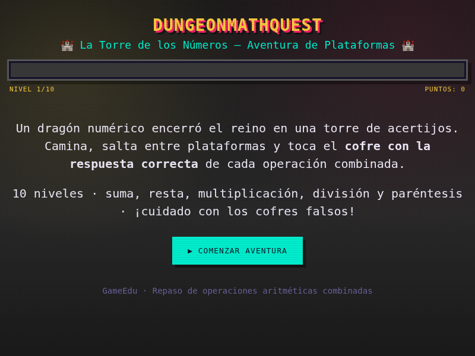

[Volver al portafolio](../../README.md)

---

## El caso de negocio

Esta práctica planteaba el siguiente problema: *GameEdu*, una empresa dedicada a soluciones educativas mediante videojuegos, recibió el encargo de una institución de secundaria de crear un juego para repasar operaciones aritméticas de forma entretenida. El cliente pedía específicamente:

- Dirigido a estudiantes de 1ro de secundaria.
- Temática de aventura de plataformas inspirada en videojuegos clásicos.
- 10 preguntas de suma, resta, multiplicación y división, con 4 alternativas cada una.
- 1 punto por respuesta correcta, puntuación final sobre 10.
- Feedback inmediato de si la respuesta es correcta o incorrecta.
- Funcionar directamente en un navegador, generado mediante IA a partir de un prompt.

## Sobre el juego

Un dragón numérico encerró el reino en una torre de acertijos. El jugador escala la torre saltando entre plataformas y debe tocar el **cofre con la respuesta correcta** de cada operación combinada — los demás cofres son señuelos que hacen perder el intento si se tocan primero.

- **De qué trata:** escalar una torre resolviendo matemáticas mientras se controla a un personaje en un entorno de plataformas.
- **Objetivo del jugador:** completar los 10 niveles eligiendo siempre el cofre correcto, para obtener el mejor rango posible al final.
- **Mecánica principal:** movimiento lateral + salto entre plataformas, combinado con la resolución de una operación aritmética por nivel.

## Controles

| Acción | Tecla |
|---|---|
| Moverse a la izquierda | `←` / `A` |
| Moverse a la derecha | `→` / `D` |
| Saltar | `↑` / `W` / `ESPACIO` |
| Avanzar / continuar | Botón en pantalla |

También tiene botones táctiles en pantalla para jugar desde el celular.

## Sistema de puntaje

| Puntaje | Rango |
|---|---|
| 10/10 | Gran Maestro del Reino |
| 8-9/10 | Caballero Calculador |
| 6-7/10 | Aprendiz Valiente |
| 4-5/10 | Escudero en Entrenamiento |
| menos de 4 | Sigue practicando |

## Tecnología

- HTML5 (`<canvas>` para el renderizado del personaje y las plataformas)
- CSS3 (estética retro pixel-art, fuentes `Press Start 2P` y `VT323`)
- JavaScript vanilla — física de salto, colisiones plataforma/cofre, generación de niveles y validación de operaciones

---

## Historial de versiones

<table>
<tr><th align="left">Versión</th><th align="left">Qué cambió</th><th align="center">Jugar</th><th align="center">Código</th></tr>
<tr>
<td><b>v1 — Quiz</b></td>
<td>Prototipo inicial: sin plataformas ni movimiento del personaje. Se mostraba la operación y 4 posibles resultados para elegir. Sirvió para validar la lógica de generación de operaciones y el sistema de puntaje antes de invertir tiempo en física.</td>
<td align="center"><a href="https://sandiacamil.github.io/game-development-portfolio/games/dungeonmathquest/versions/v1-quiz.html">Jugar</a></td>
<td align="center"><a href="versions/v1-quiz.html">Ver</a></td>
</tr>
<tr>
<td><b>v2 — Nivel plano</b></td>
<td>Primer entorno de plataformas real: el personaje ya se mueve y salta físicamente, y hay que tocar el cofre correcto entre varios distribuidos en el nivel. Todos los cofres están al ras del suelo — el salto existe pero el diseño de nivel aún no lo exige.</td>
<td align="center"><a href="https://sandiacamil.github.io/game-development-portfolio/games/dungeonmathquest/versions/v2-flatlevel.html">Jugar</a></td>
<td align="center"><a href="versions/v2-flatlevel.html">Ver</a></td>
</tr>
<tr>
<td><b>v3 — Final</b></td>
<td>Se agregaron plataformas a distinta altura, obligando a saltar entre ellas. Se sumaron cofres falsos como factor de riesgo y controles táctiles para jugar desde el celular.</td>
<td align="center"><a href="https://sandiacamil.github.io/game-development-portfolio/games/dungeonmathquest/">Jugar</a></td>
<td align="center"><a href="index.html">Ver</a></td>
</tr>
</table>

### v1 — Quiz

 Pantalla de bienvenida — se elige la respuesta entre 4 opciones, sin plataformas

### v2 — Nivel plano

<table>
<tr>
<td align="center"> Pantalla de bienvenida</td>
<td align="center"> Gameplay — cofres al ras del suelo</td>
</tr>
</table>

### v3 — Final

<table>
<tr>
<td align="center"> Pantalla de bienvenida</td>
<td align="center"> Gameplay — plataformas y operación combinada</td>
</tr>
</table>

---

[Volver al portafolio principal](../../README.md)
