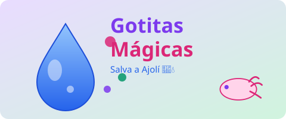
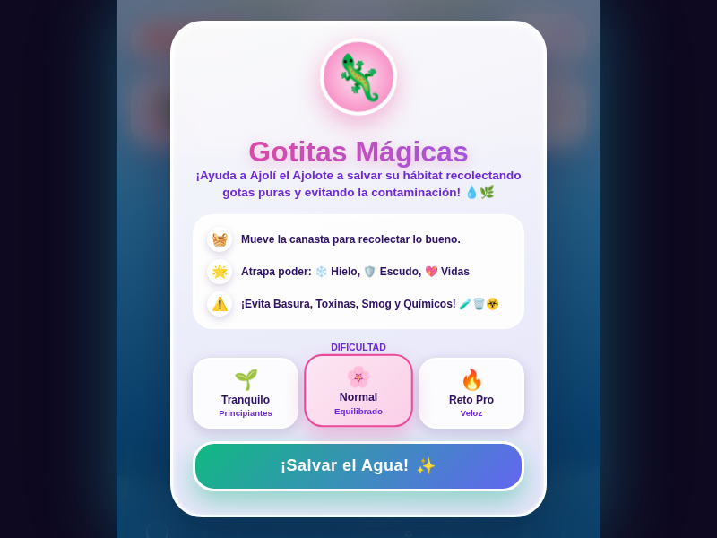
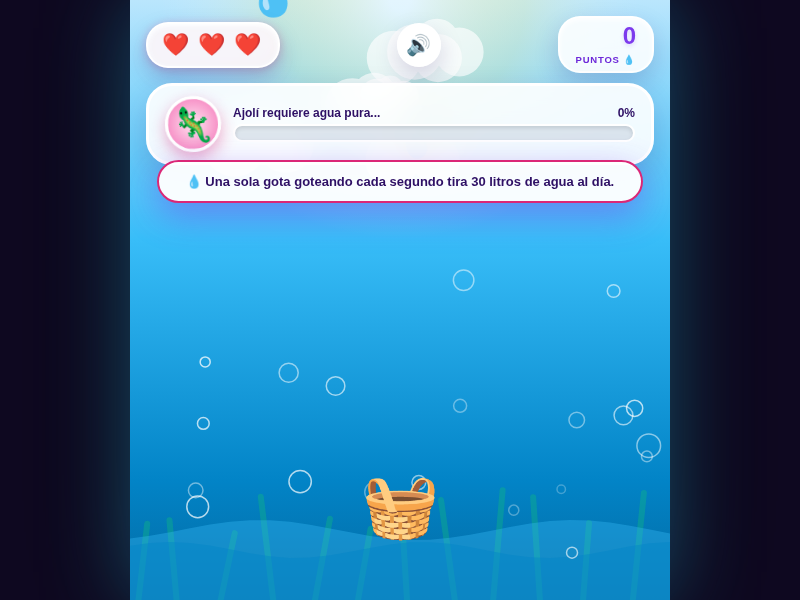

[Volver al portafolio](../../README.md)

---

## La metodología aplicada

Esta práctica (Mecánicas de juego) exigía diferenciar mecánica, dinámica y estética (marco **MDA**) y clasificar géneros de videojuegos, analizando primero un caso real (*Polarity Switch*) antes de diseñar el propio prototipo. El punto central de la práctica era justificar el género y la mecánica principal **antes de programar nada** — evitando el error del caso planteado en la guía, donde un juego anterior fracasó porque nadie entendía qué debía hacer para "ganar". Ese mismo proceso de justificación de diseño se aplicó aquí a un tema de concientización sobre el cuidado del agua.

## Sobre el juego

**Gotitas Mágicas** es un arcade tipo catcher: Ajolí, un pequeño ajolote, necesita agua pura para sobrevivir, y el jugador mueve una canasta a lo largo de la parte inferior de la pantalla para atrapar gotas de agua limpia mientras evita otros elementos que caen. El juego intercala mensajes educativos reales sobre consumo de agua directamente en la experiencia, no como texto aparte.

- **De qué trata:** purificar agua para Ajolí atrapando gotas limpias con una canasta, aprendiendo sobre el cuidado del recurso hídrico en el proceso.
- **Objetivo del jugador:** llenar la barra de progreso de "agua pura" antes de quedarse sin las 3 vidas, subiendo de nivel a medida que avanza.
- **Mecánica principal:** mover la canasta horizontalmente para atrapar gotas y power-ups que caen desde la parte superior de la pantalla.

## Controles

| Acción | Control |
|---|---|
| Mover la canasta | Mover el mouse horizontalmente |
| En móvil | Deslizar el dedo horizontalmente |

## Power-ups

| Power-up | Efecto |
|---|---|
| Hielo | Ralentiza la caída de elementos |
| Escudo | Protege una vida ante un fallo |
| Vida extra | Suma una vida adicional |

## Tecnología

- HTML5 y CSS3 — interfaz con tarjetas tipo glassmorphism, animaciones de nubes, burbujas y texto flotante
- JavaScript vanilla — loop de juego, generación de objetos que caen, colisión con la canasta, sistema de niveles y progreso
- `localStorage` — persistencia del puntaje más alto entre partidas

---

## Historial de versiones

<table>
<tr><th align="left">Versión</th><th align="left">Qué incluye</th><th align="center">Jugar</th><th align="center">Código</th></tr>
<tr>
<td><b>v1 — Única</b></td>
<td>Ciclo completo de juego: vidas, power-ups, niveles progresivos, mensajes educativos y persistencia del puntaje más alto.</td>
<td align="center"><a href="https://sandiacamil.github.io/game-development-portfolio/games/gotitas-magicas/">Jugar</a></td>
<td align="center"><a href="index.html">Ver</a></td>
</tr>
</table>

<table>
<tr>
<td align="center"> Pantalla de bienvenida</td>
<td align="center"> Gameplay — atrapando gotas para Ajolí</td>
</tr>
</table>

> A diferencia de DungeonMathQuest y Trashketball, Gotitas Mágicas todavía no tiene betas intermedias documentadas — es el prototipo más reciente del portafolio. Queda como base para las siguientes iteraciones.

---

[Volver al portafolio principal](../../README.md)
