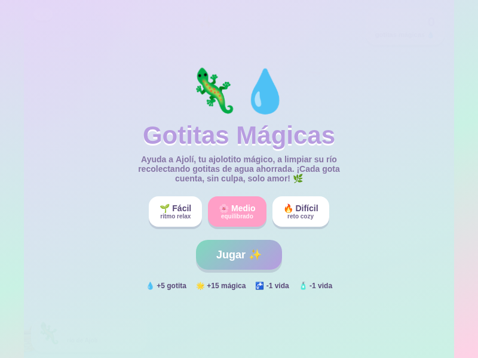
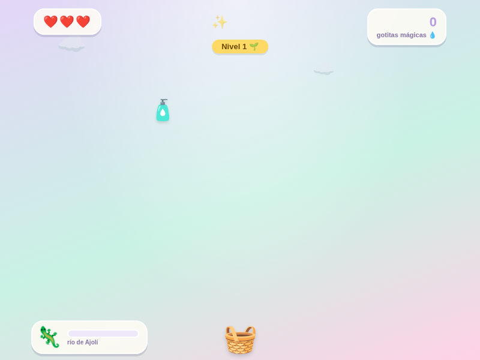
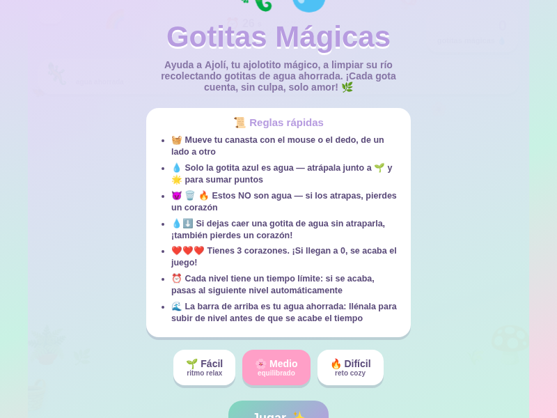
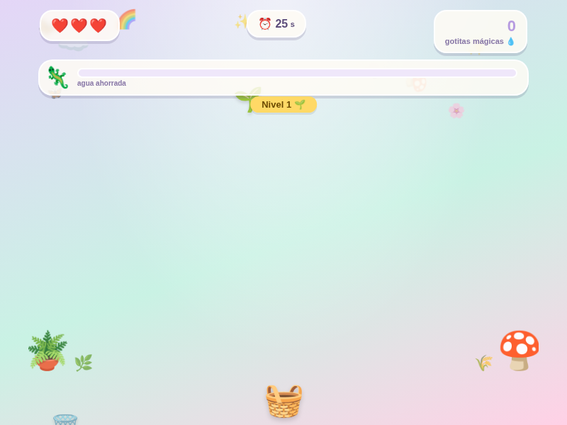

[Volver al portafolio](../../README.md)

---

## Sobre el juego

**Gotitas Mágicas** convierte el mensaje de "no desperdicies agua" —el tipo de campaña que la mayoría de la gente joven ignora en un afiche o spot— en un arcade rápido y directo: Ajolí, un ajolotito, necesita que su río se mantenga limpio, y el jugador mueve una canasta para atrapar únicamente las gotas de agua limpia que caen, evitando el resto de objetos que no son agua. Dejar caer una gota o atrapar algo que no corresponde cuesta una vida, acompañado de un mensaje breve sobre el desperdicio del recurso.

La idea es que el jugador entienda, jugando y sin que se sienta una lección, que **cada gota que se deja caer es agua que se pierde** — el mismo mensaje que las campañas tradicionales de ahorro de agua no logran transmitir a un público joven que las ignora por completo.

- **De qué trata:** atrapar únicamente gotas de agua limpia con una canasta, evitando el resto de elementos que caen, para mantener a Ajolí a salvo.
- **Objetivo del jugador:** acumular la mayor cantidad de "agua ahorrada" posible antes de quedarse sin vidas o sin tiempo.
- **Mecánica principal:** mover la canasta horizontalmente para atrapar gotas de agua entre una cantidad creciente de objetos que caen, con dificultad progresiva tanto en velocidad como en cantidad simultánea de objetos.

## Controles

| Acción | Control |
|---|---|
| Mover la canasta | Mover el mouse horizontalmente |
| En móvil | Deslizar el dedo horizontalmente |

## Sistema de juego

| Elemento | Descripción |
|---|---|
| Vidas | Se pierde una vida al dejar caer una gota de agua o atrapar algo que no es agua |
| Tiempo | Cada nivel tiene un límite de tiempo; si se acaba, se pasa automáticamente al siguiente |
| Dificultad | Sube por velocidad de caída y por cantidad de objetos simultáneos en pantalla |
| Niveles de dificultad | Fácil, Medio y Difícil, seleccionables antes de jugar |

## Tecnología

- HTML5 y CSS3 — interfaz con tarjetas tipo glassmorphism, animaciones de nubes, burbujas y texto flotante
- JavaScript vanilla — loop de juego, generación de objetos que caen, colisión con la canasta, sistema de niveles y progreso
- `localStorage` — persistencia del puntaje más alto entre partidas

---

## Historial de versiones

<table>
<tr><th align="left">Versión</th><th align="left">Qué cambió</th><th align="center">Jugar</th></tr>
<tr>
<td><b>v1 — Original</b></td>
<td>Primera versión jugable: selección de dificultad, recolección de gotas con la canasta. La barra de progreso ("río de Ajolí") estaba ubicada abajo, cerca de la zona de juego, y no había panel de reglas ni cronómetro visible.</td>
<td align="center"><a href="https://sandiacamil.github.io/game-development-portfolio/games/gotitas-magicas/versions/v1-original.html">Jugar</a></td>
</tr>
<tr>
<td><b>v2</b></td>
<td>Se agregó un panel de reglas rápidas antes de empezar, un cronómetro visible por nivel, y la barra de progreso se renombró a "agua ahorrada" y se movió arriba para dejar libre la zona de juego. Los elementos decorativos (plantas, hongo) se reubicaron fuera del área jugable.</td>
<td align="center"><a href="https://sandiacamil.github.io/game-development-portfolio/games/gotitas-magicas/versions/v2-reglas.html">Jugar</a></td>
</tr>
<tr>
<td><b>v3 — Final</b></td>
<td>Ciclo de juego completo: power-ups, niveles progresivos, mensajes educativos y persistencia del puntaje más alto.</td>
<td align="center"><a href="https://sandiacamil.github.io/game-development-portfolio/games/gotitas-magicas/">Jugar</a></td>
</tr>
</table>

### v1 — Original

<table>
<tr>
<td align="center"> Pantalla de bienvenida</td>
<td align="center"> Gameplay — barra "río de Ajolí" abajo</td>
</tr>
</table>

### v2

<table>
<tr>
<td align="center"> Pantalla de bienvenida — nuevo panel de reglas</td>
<td align="center"> Gameplay — barra "agua ahorrada" arriba, cronómetro visible</td>
</tr>
</table>

### v3 — Final

<table>
<tr>
<td align="center"> Pantalla de bienvenida</td>
<td align="center"> Gameplay — atrapando gotas para Ajolí</td>
</tr>
</table>

---

[Volver al portafolio principal](../../README.md)
