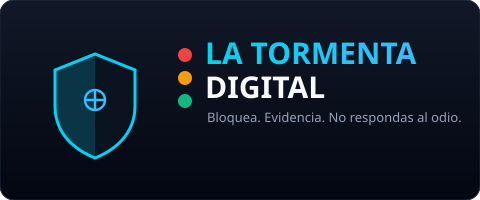
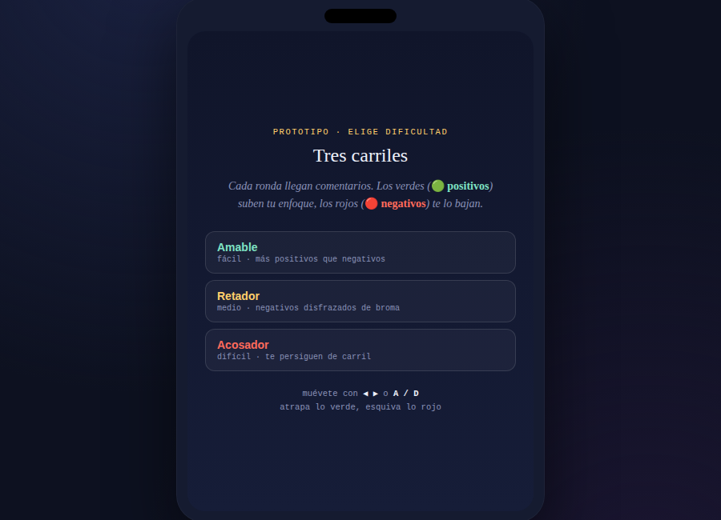
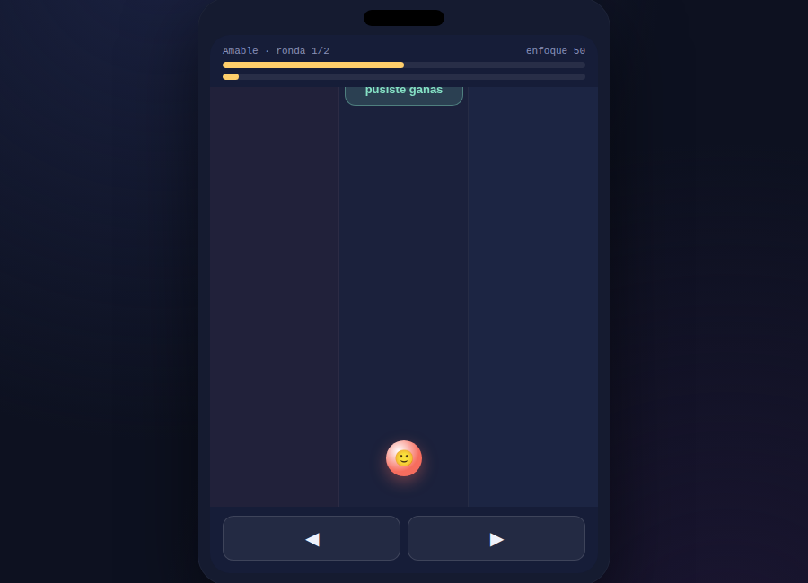
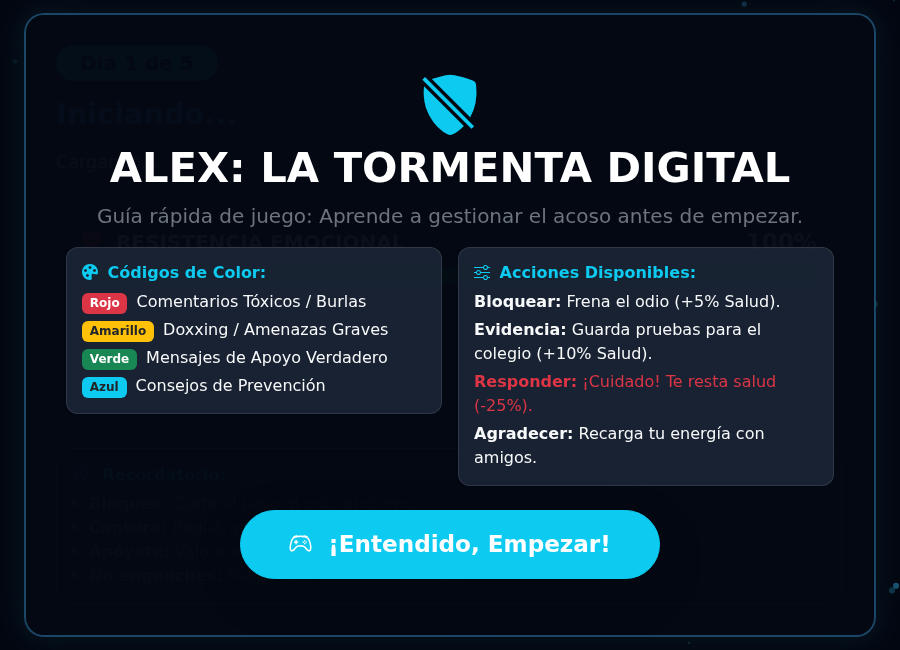
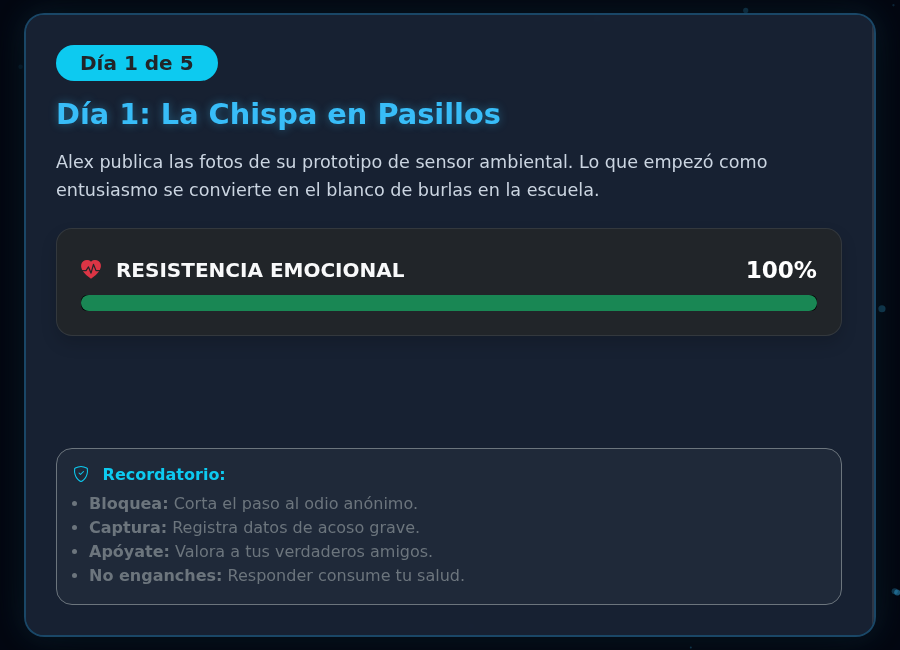
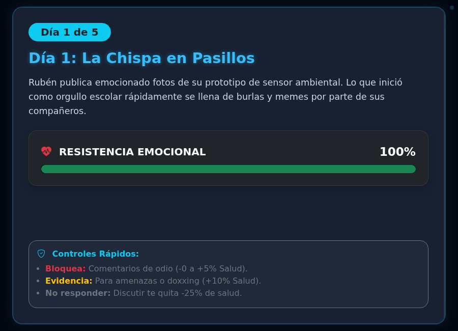

[Volver al portafolio](../../README.md)

---

## Sobre el juego

**La Tormenta Digital** cuenta, día por día, lo que le pasa a un estudiante que sube a redes el proyecto en el que más entusiasmo puso — y se convierte en blanco de burlas, rumores y amenazas anónimas. El jugador no controla un personaje que dispara o esquiva: controla las **decisiones** frente a cada comentario que aparece en el muro. Responder al ataque agota la salud emocional; bloquear, guardar evidencia y apoyarse en la gente que sí ayuda, la recupera.

El mensaje central es directo: **engancharse a pelear con el odio anónimo hace más daño que el odio mismo**, y las herramientas reales para salir de una situación de acoso son bloquear, documentar y pedir ayuda a un adulto — no discutir en los comentarios.

- **De qué trata:** sobrevivir emocionalmente a varios días de acoso digital tomando la decisión correcta ante cada comentario que aparece.
- **Objetivo del jugador:** llegar al final de la historia manteniendo la salud/resistencia emocional arriba de cero, sin caer en la provocación.
- **Mecánica principal:** ante cada comentario (clasificado por color según su tipo) elegir una acción — Bloquear, Guardar evidencia, Responder o Agradecer — cada una con un efecto distinto sobre la salud emocional del protagonista.

## Controles

| Acción | Control |
|---|---|
| Elegir una acción sobre el comentario | Click / touch en el botón correspondiente |
| Avanzar de día | Botón en pantalla al cerrar cada jornada |

## Códigos de color y acciones (versión final)

| Color | Tipo de comentario |
|---|---|
| Rojo | Comentarios tóxicos / burlas |
| Amarillo | Doxxing / amenazas graves |
| Verde | Mensajes de apoyo verdadero |
| Azul | Consejos de prevención |

| Acción | Efecto |
|---|---|
| Bloquear | Frena el odio (+5% salud) |
| Guardar evidencia | Prueba para reportar el caso (+10% salud) |
| Responder | Discutir con el agresor (-25% salud) |
| Agradecer | Recarga energía apoyándose en amistades reales |

## Tecnología

- HTML5 y Bootstrap 5 para la interfaz de tarjetas y paneles narrativos
- JavaScript vanilla — máquina de estados por día, generación de comentarios, cálculo de salud emocional
- Bootstrap Icons para los íconos de interfaz

---

## Historial de versiones

<table>
<tr><th align="left">Versión</th><th align="left">Qué cambió</th><th align="center">Jugar</th></tr>
<tr>
<td><b>v1 — Tres carriles</b></td>
<td>Primer prototipo, un mini-juego de esquivar: los comentarios caen por 3 carriles y hay que moverse para atrapar los positivos y evitar los negativos, subiendo o bajando un medidor de "enfoque". Sin narrativa todavía.</td>
<td align="center"><a href="https://sandiacamil.github.io/game-development-portfolio/games/la-tormenta-digital/versions/v1-tres-carriles.html">Jugar</a></td>
</tr>
<tr>
<td><b>v2 — Alex</b></td>
<td>Se reemplazó por completo la mecánica de esquivar por una narrativa interactiva por días: aparece el protagonista (Alex), su historia con el proyecto de ciencias, y el sistema de decisiones (Bloquear/Evidencia/Responder/Agradecer) sobre un feed de comentarios reales.</td>
<td align="center"><a href="https://sandiacamil.github.io/game-development-portfolio/games/la-tormenta-digital/versions/v2-alex.html">Jugar</a></td>
</tr>
<tr>
<td><b>v3 — Final</b></td>
<td>Se amplió el sistema de comentarios de 2 a 4 categorías (se sumaron amarillo para doxxing/amenazas graves y azul para consejos de prevención), y el protagonista pasó a llamarse Rubén.</td>
<td align="center"><a href="https://sandiacamil.github.io/game-development-portfolio/games/la-tormenta-digital/">Jugar</a></td>
</tr>
</table>

### v1 — Tres carriles

<table>
<tr>
<td align="center"> Pantalla de bienvenida</td>
<td align="center"> Gameplay — esquivar comentarios por carriles</td>
</tr>
</table>

### v2 — Alex

<table>
<tr>
<td align="center"> Pantalla de bienvenida</td>
<td align="center"> Gameplay — narrativa día 1, resistencia emocional</td>
</tr>
</table>

### v3 — Final

<table>
<tr>
<td align="center"> Pantalla de bienvenida — 4 códigos de color</td>
<td align="center"> Gameplay — protagonista Rubén, sistema de acciones ampliado</td>
</tr>
</table>

---

[Volver al portafolio principal](../../README.md)
