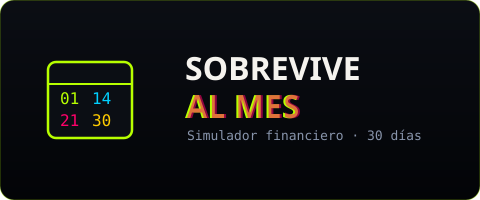
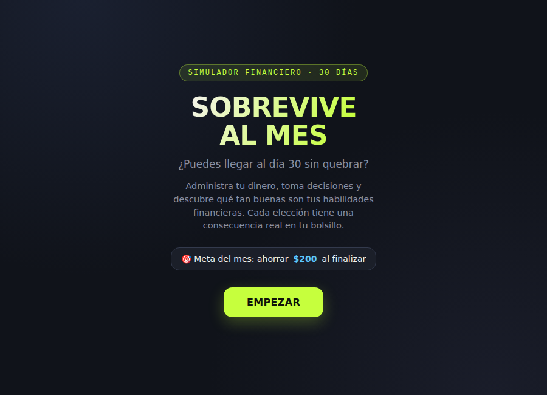
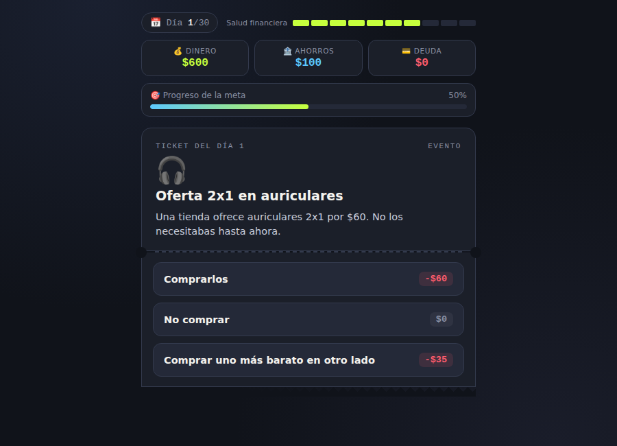
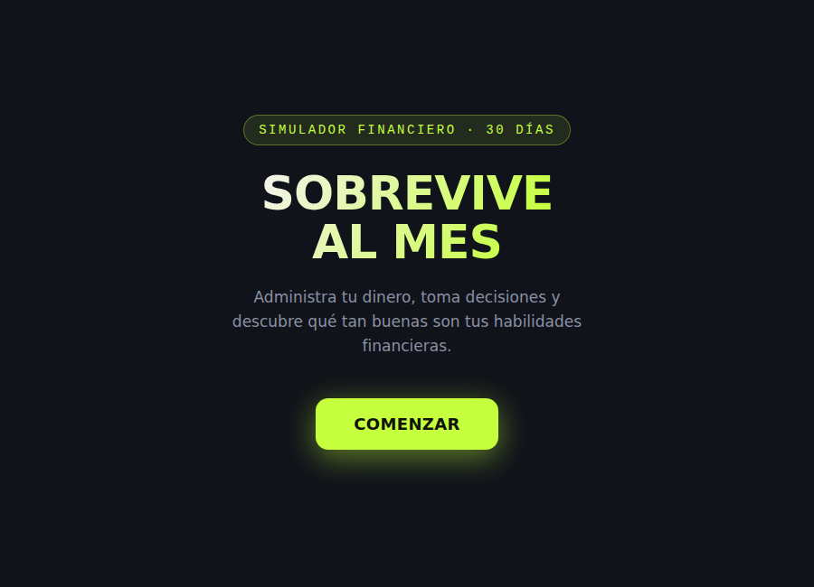
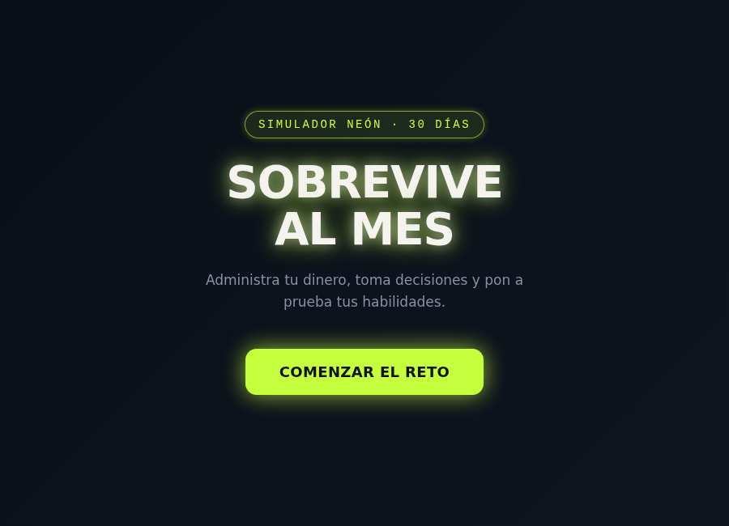
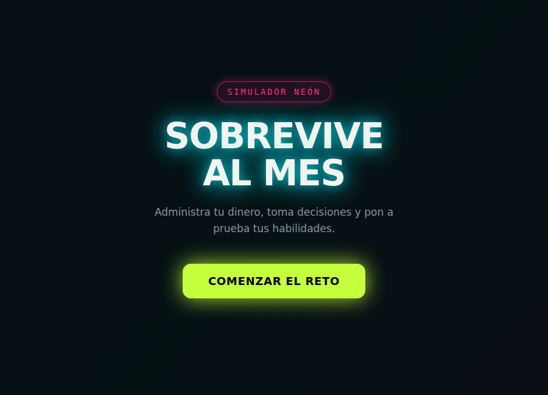
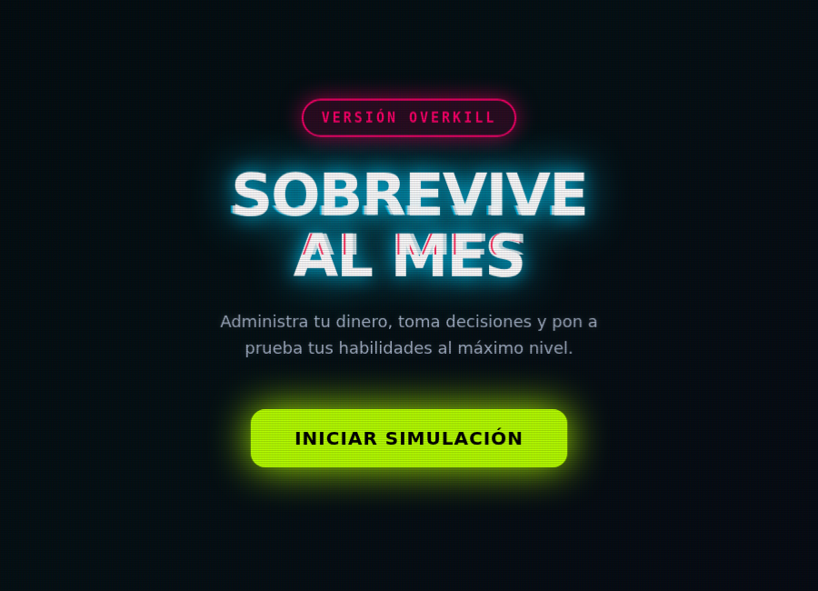
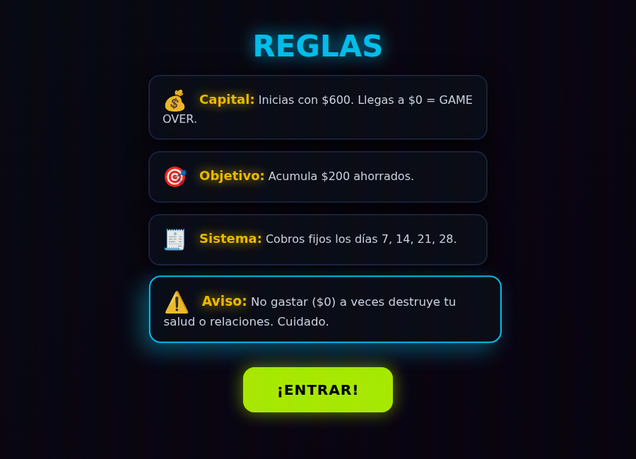

[Volver al portafolio](../../README.md)

---

## Sobre el juego

**Sobrevive al Mes** simula 30 días de vida financiera real: el jugador arranca con un capital fijo y una meta de ahorro, y cada día se enfrenta a una decisión de gasto — desde una oferta 2x1 en auriculares hasta un concierto con amigos — con dos o tres alternativas que cuestan distinto y afectan distinto su bolsillo. No hay una decisión "correcta" obvia: cada elección es un balance entre disfrutar el presente y proteger la meta de ahorro, con cobros fijos obligatorios en fechas concretas del mes que hay que tener cubiertos.

El mensaje es simple pero directo: **el manejo del dinero no se aprende memorizando consejos, se siente al tomar decisiones bajo presión y ver la consecuencia inmediata en el saldo.** Llegar a $0 antes de fin de mes es perder, sin importar cuántas veces se haya "disfrutado" el camino.

- **De qué trata:** administrar el dinero de un mes completo tomando una decisión de gasto por día, sin quedarse sin saldo antes del día 30.
- **Objetivo del jugador:** llegar al día 30 con al menos el monto de ahorro meta, sin que el dinero disponible caiga a $0 en el camino.
- **Mecánica principal:** cada día se presenta un evento con 2-3 opciones de distinto costo; elegir una actualiza dinero, ahorro y a veces una "salud financiera" general, y el juego avanza al día siguiente.

## Controles

| Acción | Control |
|---|---|
| Elegir una opción del evento del día | Click / touch sobre la tarjeta de opción |
| Avanzar de día | Automático al confirmar una decisión |

## Sistema de juego (versión final)

| Elemento | Descripción |
|---|---|
| Capital inicial | $600 — llegar a $0 es game over |
| Meta | Acumular $200 ahorrados antes del día 30 |
| Cobros fijos | Gastos obligatorios en los días 7, 14, 21 y 28 |
| Riesgo | No gastar en absoluto también puede afectar la salud o las relaciones del personaje |

## Tecnología

- HTML5 y CSS3 — interfaz de tarjetas de evento con estética neón (glow, glitch text en la versión final)
- JavaScript vanilla — motor de eventos diarios, cálculo de saldo/ahorro/deuda, condición de victoria y derrota

---

## Historial de versiones

Este es el prototipo con más iteraciones visuales del portafolio: partió de una interfaz simple y pasó por sucesivos rediseños hasta la estética neón/glitch final, mientras la mecánica de fondo (30 días, eventos de gasto, meta de ahorro) se mantuvo estable desde la primera versión.

<table>
<tr><th align="left">Versión</th><th align="left">Qué cambió</th><th align="center">Jugar</th></tr>
<tr>
<td><b>v1 — Original</b></td>
<td>Primera versión funcional: simulador de 30 días con capital inicial, meta de ahorro y eventos diarios de gasto con 3 opciones cada uno. Interfaz oscura simple, sin efectos visuales.</td>
<td align="center"><a href="https://sandiacamil.github.io/game-development-portfolio/games/sobrevive-al-mes/versions/v1-original.html">Jugar</a></td>
</tr>
<tr>
<td><b>v2</b></td>
<td>Simplificación y limpieza del código base manteniendo la misma mecánica, como paso intermedio antes del rediseño visual.</td>
<td align="center"><a href="https://sandiacamil.github.io/game-development-portfolio/games/sobrevive-al-mes/versions/v2.html">Jugar</a></td>
</tr>
<tr>
<td><b>v3 — Edición Neón</b></td>
<td>Primer rediseño visual: paleta neón verde lima sobre fondo oscuro, tipografía y botones con efecto de brillo (glow).</td>
<td align="center"><a href="https://sandiacamil.github.io/game-development-portfolio/games/sobrevive-al-mes/versions/v3-neon.html">Jugar</a></td>
</tr>
<tr>
<td><b>v4 — Ultra Neón</b></td>
<td>Se intensificó el estilo neón y se ajustaron montos y eventos (por ejemplo, la invitación de amigos sube de precio y de impacto en el estado de ánimo del personaje).</td>
<td align="center"><a href="https://sandiacamil.github.io/game-development-portfolio/games/sobrevive-al-mes/versions/v4-ultra-neon.html">Jugar</a></td>
</tr>
<tr>
<td><b>v5 — Overkill Neon</b></td>
<td>Nueva pasada de diseño con eventos de mayor impacto (como un "Concierto Histórico" de alto costo) y ajustes de interfaz previos a la versión definitiva.</td>
<td align="center"><a href="https://sandiacamil.github.io/game-development-portfolio/games/sobrevive-al-mes/versions/v5-overkill.html">Jugar</a></td>
</tr>
<tr>
<td><b>v6 — Final</b></td>
<td>Versión definitiva: se agregó efecto de texto glitch en el título, pantalla de reglas explícitas antes de empezar (capital, objetivo, cobros fijos y advertencia de riesgo) y balance final de eventos.</td>
<td align="center"><a href="https://sandiacamil.github.io/game-development-portfolio/games/sobrevive-al-mes/">Jugar</a></td>
</tr>
</table>

### v1 — Original

 Pantalla de bienvenida — meta de ahorro de $200

 Gameplay — decisión de gasto del día 1

### v2

 Pantalla de bienvenida

### v3 — Edición Neón

 Pantalla de bienvenida — primer rediseño neón

### v4 — Ultra Neón

 Pantalla de bienvenida

### v5 — Overkill Neon

 Pantalla de bienvenida

### v6 — Final

<table>
<tr>
<td align="center"> Pantalla de bienvenida — efecto glitch</td>
<td align="center"> Panel de reglas antes de empezar</td>
</tr>
</table>

---

[Volver al portafolio principal](../../README.md)
