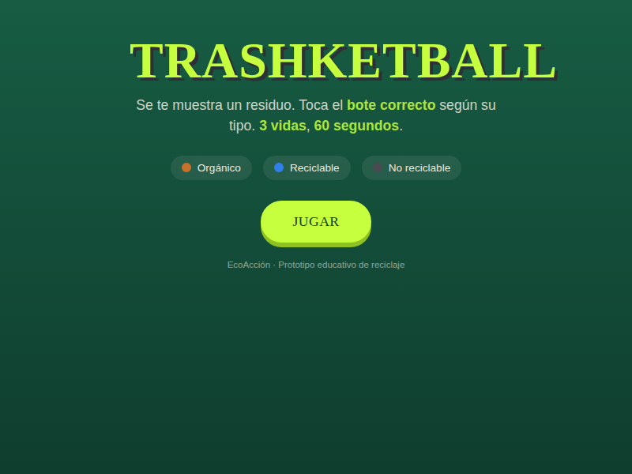
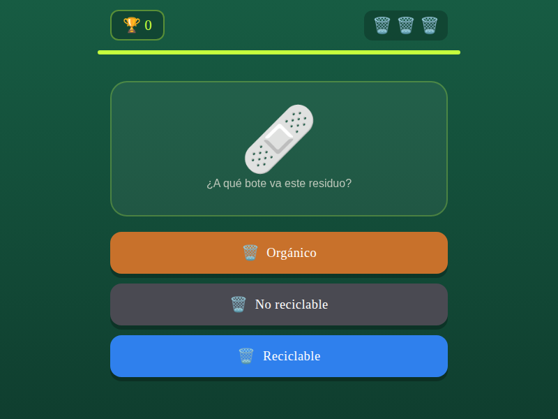
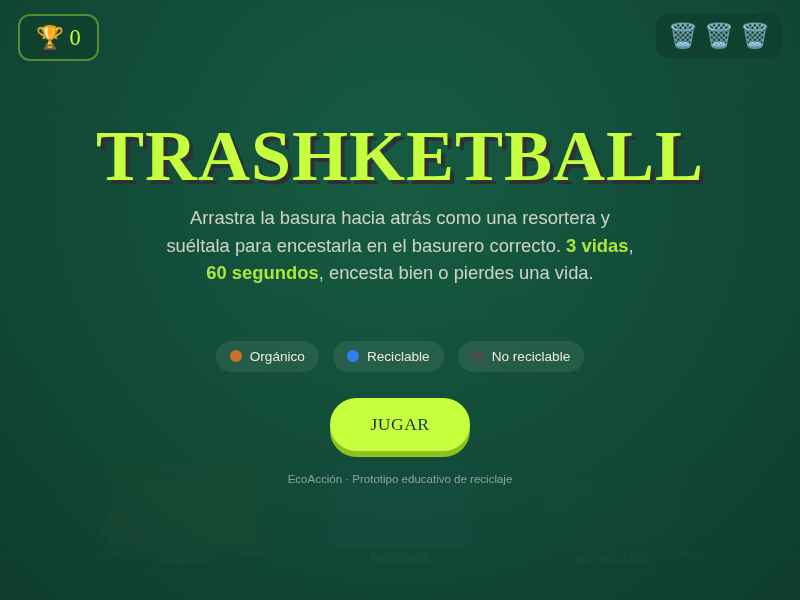
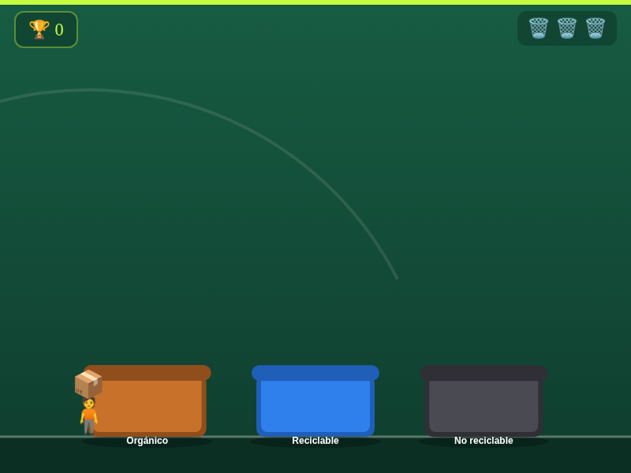

[Volver al portafolio](../../README.md)

---

## En qué se enfoca

Buena parte de la comunidad, sobre todo jóvenes y niños, no sabe separar bien los residuos reciclables — y las campañas informativas tradicionales no logran quedarse. La apuesta acá fue convertir la clasificación de basura en un arcade de puntería: la presión del tiempo y la repetición hacen que, sin darse cuenta, el jugador termine memorizando qué va en cada contenedor.

## Sobre el juego

**Trashketball** es un arcade de puntería con temática de reciclaje: cada residuo que aparece debe terminar en su contenedor correcto — orgánico, reciclable o no reciclable — antes de que se acabe el tiempo. En la versión final, un viento dinámico empuja la trayectoria en cada tiro y encestar varios seguidos activa un combo que multiplica el puntaje.

- **De qué trata:** clasificar residuos correctamente lanzándolos a su contenedor, contra el reloj.
- **Objetivo del jugador:** acumular la mayor cantidad de puntos en 60 segundos, encestando en el bote correcto y manteniendo el combo activo.
- **Mecánica principal:** arrastrar el residuo hacia atrás como una resortera y soltarlo con el ángulo y fuerza correctos, compensando además el viento.

## Controles

| Acción | Control |
|---|---|
| Cargar el tiro | Click / touch y mantener presionado sobre el residuo |
| Apuntar | Arrastrar el mouse / dedo hacia atrás (efecto resortera) |
| Lanzar | Soltar el click / touch |

## Mecánicas destacadas (versión final)

| Elemento | Descripción |
|---|---|
| Viento dinámico | Cada tiro tiene una fuerza de viento aleatoria que desvía la trayectoria |
| Combos | Encestar seguido multiplica los puntos obtenidos |
| Vidas | 3 vidas — fallar el contenedor correcto descuenta una |
| Tiempo | Partidas cronometradas de 60 segundos |
| Escenario urbano | Fondo de ciudad animado |

## Tecnología

- HTML5 (`<canvas>` para la física del lanzamiento y las animaciones)
- CSS3 para la interfaz (HUD de puntaje, combo, indicador de viento)
- JavaScript vanilla — trayectoria tipo proyectil, sistema de viento aleatorio, colisión con cada contenedor, manejo de eventos de mouse/touch

---

## Historial de versiones

Trashketball es el proyecto que más iteraciones tuvo en este portafolio: cambió de mecánica central dos veces antes de llegar a su forma final.

<table>
<tr><th align="left">Versión</th><th align="left">Qué cambió</th><th align="center">Jugar</th></tr>
<tr>
<td><b>v1 — Quiz</b></td>
<td>Se mostraba un residuo y había que tocar el bote correcto entre 3 opciones. Sin física ni lanzamiento — validaba el concepto educativo antes de sumar puntería.</td>
<td align="center"><a href="https://sandiacamil.github.io/game-development-portfolio/games/trashketball/versions/v1-quiz.html">Jugar</a></td>
</tr>
<tr>
<td><b>v2 — Resortera</b></td>
<td>Se reemplazó el toque directo por arrastrar y soltar tipo resortera, calculando fuerza y ángulo. Se agregaron 3 vidas y el cronómetro de 60 segundos.</td>
<td align="center"><a href="https://sandiacamil.github.io/game-development-portfolio/games/trashketball/versions/v2-slingshot.html">Jugar</a></td>
</tr>
<tr>
<td><b>v3 — Extreme Pro</b></td>
<td>Se sumó viento dinámico por tiro, sistema de combos con multiplicador y un fondo de ciudad animado que reemplazó el escenario plano.</td>
<td align="center"><a href="https://sandiacamil.github.io/game-development-portfolio/games/trashketball/">Jugar</a></td>
</tr>
</table>

### v1 — Quiz

<table>
<tr>
<td align="center"> Pantalla de bienvenida</td>
<td align="center"> Gameplay — tocar el bote correcto</td>
</tr>
</table>

### v2 — Resortera

<table>
<tr>
<td align="center"> Pantalla de bienvenida</td>
<td align="center"> Gameplay — trayectoria tipo resortera</td>
</tr>
</table>

### v3 — Extreme Pro

<table>
<tr>
<td align="center"> Pantalla de bienvenida</td>
<td align="center"> Gameplay — viento, combo y ciudad de fondo</td>
</tr>
</table>

---

[Volver al portafolio principal](../../README.md)
