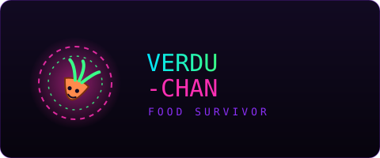
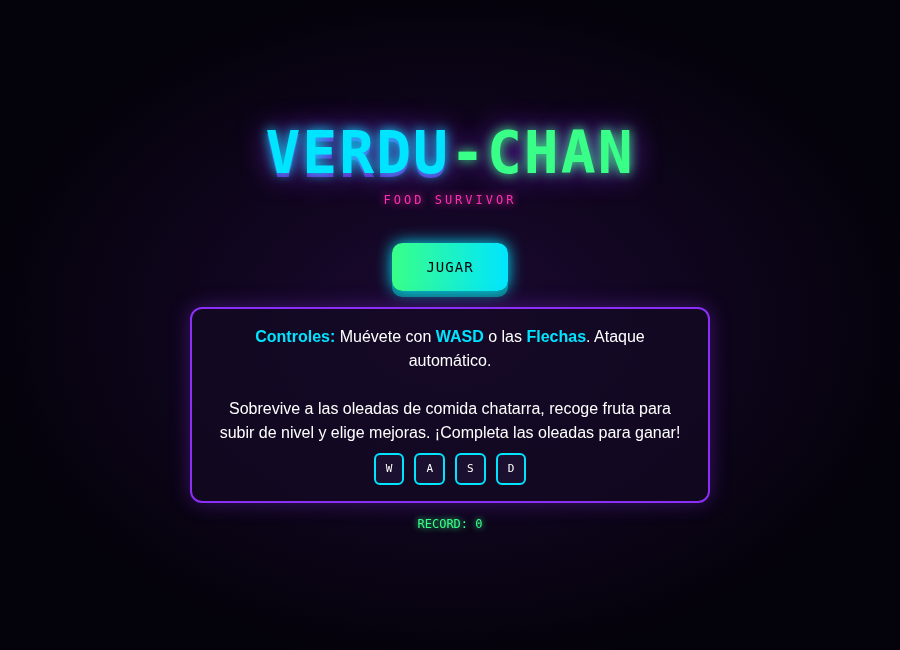
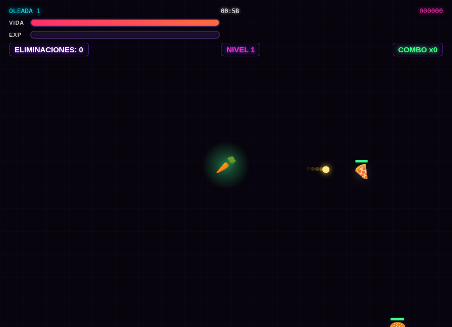
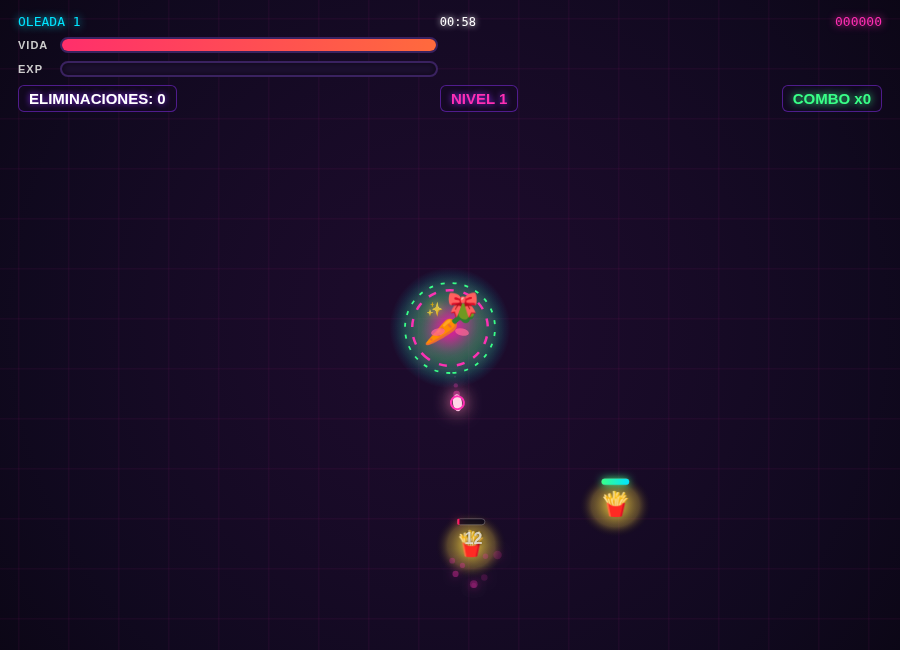
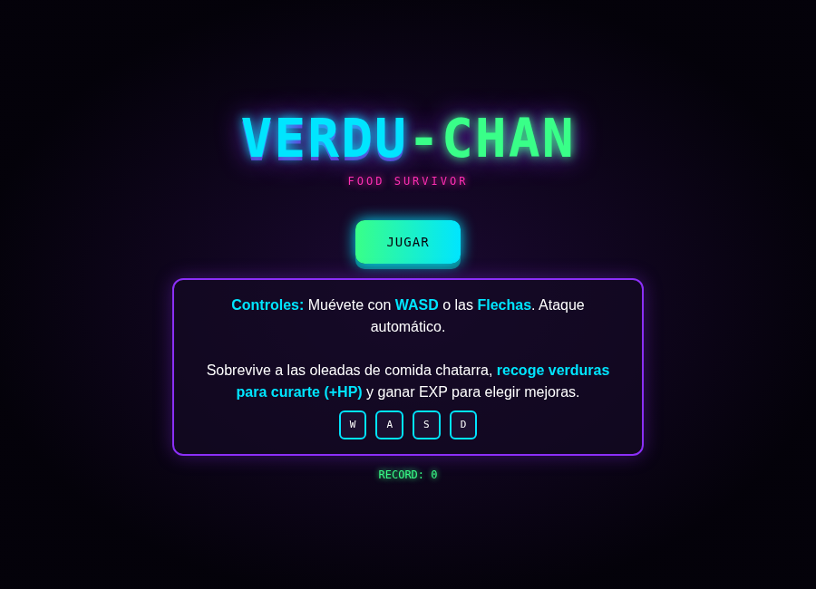
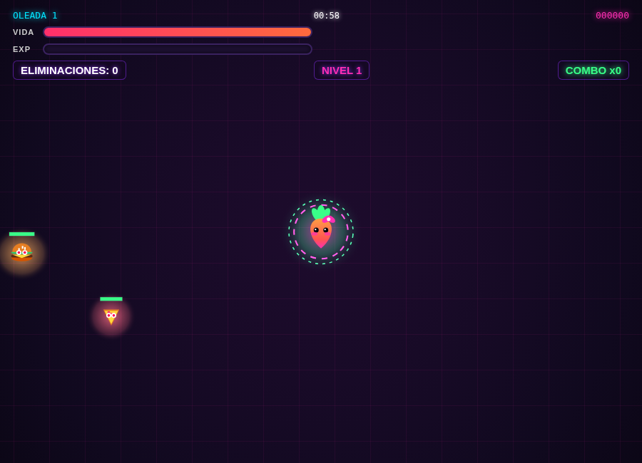

[Volver al portafolio](../../README.md)

---

## Sobre el juego

**Verdu-chan: Guerra Contra la Comida Chatarra** es un roguelike tipo *survivor* (en la línea de Vampire Survivors): Verdu-chan, una zanahoria protagonista, debe resistir oleadas crecientes de comida chatarra (hamburguesas, pizzas, papas fritas, donas, gaseosas, hot dogs y chocolate) que la atacan sin parar, mientras recoge verduras para curarse y ganar experiencia con la que elegir mejoras entre oleada y oleada.

- **De qué trata:** sobrevivir a oleadas de comida chatarra con ataque automático, subiendo de nivel para volverse más fuerte.
- **Objetivo del jugador:** completar todas las oleadas sin perder toda la vida, maximizando eliminaciones y racha de combo.
- **Mecánica principal:** movimiento libre en 8 direcciones + ataque automático hacia los enemigos más cercanos; recolectar verduras sueltas por el mapa cura vida y otorga experiencia para desbloquear mejoras.

## Controles

| Acción | Tecla |
|---|---|
| Moverse | `WASD` o flechas |
| Ataque | Automático, no requiere botón |
| En móvil | Joystick táctil en pantalla |

## Sistema de progresión

| Elemento | Descripción |
|---|---|
| Oleadas | La cantidad y fuerza de enemigos crece con cada oleada superada |
| Experiencia | Se gana recogiendo verduras sueltas por el mapa |
| Mejoras | Al subir de nivel se elige una mejora entre varias cartas |
| Combo | Eliminar enemigos seguido aumenta el contador de combo |
| Curación | Las verduras también restauran vida al recogerlas (agregado en v3) |

## Tecnología

- HTML5 (`<canvas>` para el renderizado vectorial de personaje, enemigos y partículas)
- CSS3 (estética neon/synthwave, tipografía `Press Start 2P`)
- JavaScript vanilla — spawn de oleadas, sistema de partículas, Web Audio API para el sonido (sin archivos de audio externos), persistencia de récord en `localStorage`

---

## Historial de versiones

<table>
<tr><th align="left">Versión</th><th align="left">Qué cambió</th><th align="center">Jugar</th><th align="center">Código</th></tr>
<tr>
<td><b>v1 — Original</b></td>
<td>Primera versión jugable completa: oleadas, ataque automático, sistema de mejoras y recolección de fruta genérica (🍎🍌🍓🍊) que solo otorgaba experiencia.</td>
<td align="center"><a href="https://sandiacamil.github.io/game-development-portfolio/games/verdu-chan/versions/v1-original.html">Jugar</a></td>
<td align="center"><a href="versions/v1-original.html">Ver</a></td>
</tr>
<tr>
<td><b>v2 — Balance</b></td>
<td>Ajuste de tamaños de enemigos y colores de la interfaz de mejoras (se invirtió la paleta cian/rosa de las cartas), y se amplió la variedad de fruta recolectable de 4 a 6 tipos.</td>
<td align="center"><a href="https://sandiacamil.github.io/game-development-portfolio/games/verdu-chan/versions/v2-balance.html">Jugar</a></td>
<td align="center"><a href="versions/v2-balance.html">Ver</a></td>
</tr>
<tr>
<td><b>v3 — Final</b></td>
<td>Se reemplazó la fruta genérica por verduras temáticas (brócoli, tomate, palta, zanahoria) que además de dar experiencia ahora también curan vida al recogerlas, reforzando el mensaje de alimentación saludable. Se rehizo el renderizado del personaje con un aura de doble anillo y animación más pulida.</td>
<td align="center"><a href="https://sandiacamil.github.io/game-development-portfolio/games/verdu-chan/">Jugar</a></td>
<td align="center"><a href="index.html">Ver</a></td>
</tr>
</table>

### v1 — Original

<table>
<tr>
<td align="center"> Pantalla de bienvenida</td>
<td align="center"> Gameplay — fruta genérica como recolectable</td>
</tr>
</table>

### v2 — Balance

<table>
<tr>
<td align="center"> Pantalla de bienvenida</td>
<td align="center"> Gameplay — enemigos reescalados, más variedad de fruta</td>
</tr>
</table>

### v3 — Final

<table>
<tr>
<td align="center"> Pantalla de bienvenida — ya menciona "recoge verduras para curarte"</td>
<td align="center"> Gameplay — verduras temáticas, personaje con aura pulida</td>
</tr>
</table>

---

[Volver al portafolio principal](../../README.md)
